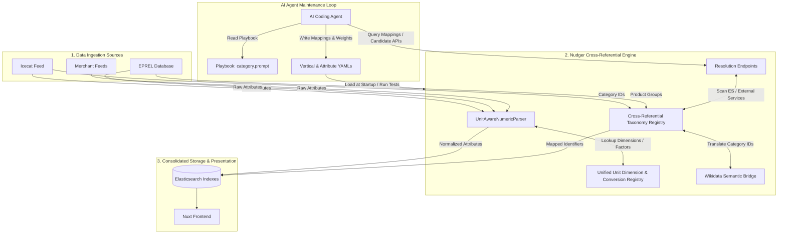
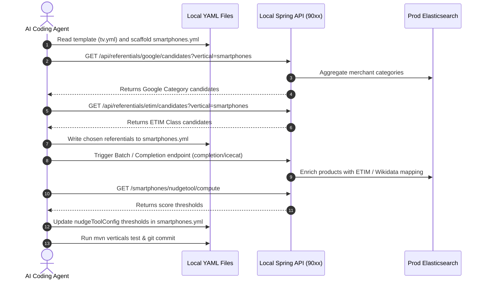
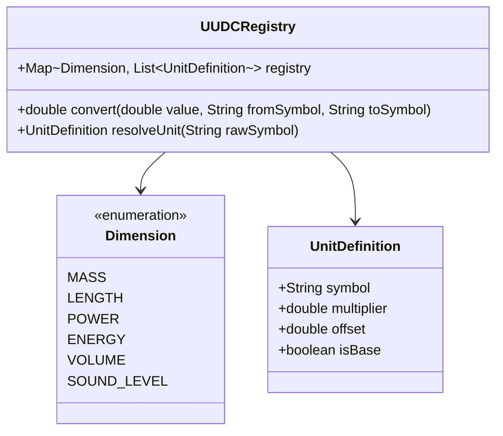
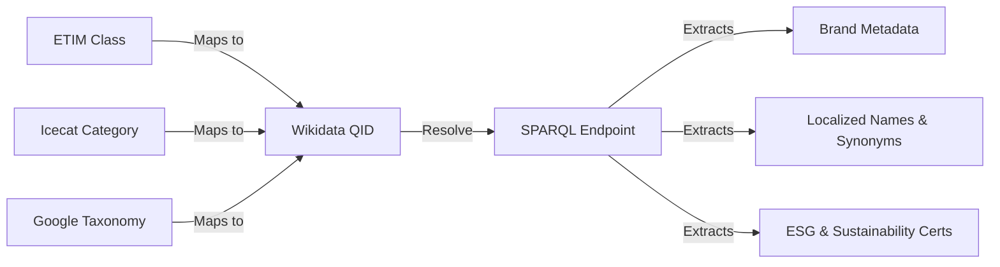

# ETIM Integration and Cross-Referential Design

This document details the architectural design to transform Nudger into a first-class **cross-referential platform** by integrating the ETIM classification standard, mapping taxonomies (Icecat, ETIM, EPREL, Google Product Taxonomy, Wikidata, and future standards like GS1 GPC and eCl@ss), and establishing a robust unit normalization engine.

It also outlines the **Agent-in-the-Loop** model where AI agents use specialized resolution endpoints to automatically maintain and update the vertical YAML configuration files.

---

## 1. Introduction and Goals

To provide consumers with clear, comparable, and actionable environmental metrics, Nudger must aggregate technical specifications from highly diverse sources. Currently, the system relies on disjoint references:
*   **Icecat** categories and feature groups.
*   **EPREL** registrations.
*   **Google Product Taxonomy** codes.
*   **Wikidata** completions.
*   **YAML overrides** within individual vertical configurations.

### Objectives
1.  **Integrate ETIM classification**: Map supported verticals to ETIM classes and ingest standard ETIM features.
2.  **Harmonize Taxonomies**: Map Icecat categories, Google Product Taxonomy, EPREL, and ETIM classes using Wikidata as a semantic translation hub.
3.  **Solve Unit Management**: Replace ad-hoc, hardcoded parsers with a configuration-driven **Unified Unit Dimension & Conversion (UUDC) Registry**.
4.  **Simplify Codebase**: Transition from custom Java parsing classes per attribute to generic, reusable parsers.
5.  **Enable AI Agent Maintenance**: Expose API endpoints that assist the AI agent in resolving candidates (Icecat, ETIM, EPREL, Google, Wikidata) so the agent can enrich the YAML config files directly.

---

## 2. Core Architecture

The proposed design organizes cross-referential mapping and attribute normalization into three decoupled layers, with a dedicated feedback loop for AI agent-driven YAML updates:



---

## 3. Cross-Referential Taxonomy Registry

Currently, vertical configurations (e.g., `dishwasher.yml`) hardcode unique identifiers for external taxonomies. This fails when a vertical maps to multiple categories or when mappings change between standard releases.

### Proposed Schema

We propose replacing simple scalar taxonomy fields with a unified `referentials` block supporting multiple mapped classes, and mapping them to their corresponding Wikidata QIDs.

```yaml
id: air-conditioner
order: 9

referentials:
  wikidata:
    - qid: "Q174488"
      name: "Air conditioner"
  google_taxonomy:
    - id: 605
      name: "Home & Garden > Household Appliances > Climate Control Appliances > Air Conditioners"
  icecat:
    - categoryId: 224
      name: "Air Conditioners"
  etim:
    - classId: "EC011604"
      className: "Portable air conditioner"
    - classId: "EC011573"
      className: "Air-conditioning split system - single split, complete"
    - classId: "EC011579"
      className: "Air-conditioning split system - multi-split, complete"
  eprel:
    - group: "airconditioners"
  # Future extensions
  gs1_gpc:
    - brickCode: "10001402"
      brickName: "Air Conditioning/Cooling Equipment"
  eclass:
    - classId: "22410101"
      className: "Air conditioner (split system)"
```

### Supported Referentials (Current & Recommended)

| Taxonomy | Focus / Role in Nudger | Mapping Level | Status |
| :--- | :--- | :--- | :--- |
| **Google Product Taxonomy** | Merchant feed categorization, shopping portals | Category ID / Path | Integrated (`googleTaxonomyId`) |
| **Icecat** | Detailed specifications, structured product sheets | Category ID / Features | Integrated (`icecatTaxonomyId`) |
| **EPREL** | Energy efficiency labels, EU registry | Product Group / Regulation | Integrated (`eprelGroupNames`) |
| **ETIM** | Technical building/electrical/HVAC standards | Class ID (`ECxxxxxx`) | Recommended (This Design) |
| **Wikidata** | Open semantic knowledge graph, brand ontology, ESG | Item QID (`Qxxxxxx`) | Recommended (This Design) |
| **GS1 GPC** | Retail/CPG standardization, GTIN/barcode alignment | Brick Code (`10xxxxxx`) | Future Option |
| **eCl@ss** | Cross-industry industrial / technical specifications | Class ID (`xxxxxx`) | Future Option |

---

## 4. AI Agent Workflow & Resolution Assistance Endpoints

A core design direction is the **Agent-in-the-Loop** model. Instead of Nudger dynamically mapping everything at runtime (which is complex and error-prone), Nudger exposes **Resolution Assistance Endpoints**. The AI Agent queries these endpoints to discover candidate mappings, validates them using ES statistics, and writes the mappings directly to the YAML configurations on disk.

### 1. Resolution Assistance Endpoints Design

We will expand the API with dedicated endpoints under `org.open4goods.controller.referential.ReferentialHelperController`:

#### Google Product Taxonomy Candidate Resolution
*   **Endpoint**: `GET /api/referentials/google/candidates?vertical={verticalId}`
*   **Behavior**: Scans merchant categories indexed in Elasticsearch under the target vertical, computes a keyword match index against the official Google Taxonomy file (`taxonomy-with-ids.fr-FR.txt`), and returns the top 3 candidate category IDs with their confidence score.

#### ETIM Class Candidate Resolution
*   **Endpoint**: `GET /api/referentials/etim/candidates?vertical={verticalId}`
*   **Behavior**:
    1. Resolves mapped Icecat category IDs for the vertical.
    2. Looks up corresponding ETIM Class IDs using local mapping tables or Wikidata equivalence properties.
    3. Returns candidates like:
       ```json
       [
         {"classId": "EC011604", "className": "Portable air conditioner", "confidence": 0.95},
         {"classId": "EC011573", "className": "Air-conditioning split system", "confidence": 0.85}
       ]
       ```

#### Wikidata Entity Candidate Resolution
*   **Endpoint**: `GET /api/referentials/wikidata/candidates?vertical={verticalId}`
*   **Behavior**: Performs a text search on the Wikidata API using the vertical's localized names and synonyms (e.g. "air conditioner", "climatiseur"), filtering for subclasses of `Q47514` (home appliance) or relevant parent concepts.

### 2. AI Agent Loop Integration (Playbook Alignment)

The AI Agent executes the playbook defined in `/home/goulven/git/private/prompts/category.prompt`:



---

## 5. Universal Unit Normalization Design

Heterogeneous raw units represent one of the primary quality issues in scraped and imported data.

### The Unified Unit Dimension & Conversion Registry (UUDC)

Instead of maintaining hardcoded parser classes for each attribute, we define physical **Dimensions** containing conversion rules. A dimension has a canonical **base unit** (used in storage and index) and conversion factors.



#### In-Code Registration (Java Enum / Config)

```java
public enum Dimension {
    MASS("kg"),
    LENGTH("m"),
    POWER("W"),
    ENERGY("kWh"),
    VOLUME("l"),
    SOUND_LEVEL("dB");

    private final String baseUnit;

    Dimension(String baseUnit) {
        this.baseUnit = baseUnit;
    }

    public String getBaseUnit() {
        return baseUnit;
    }
}
```

We configure allowed units in YAML format:

```yaml
dimensions:
  MASS:
    baseUnit: "kg"
    units:
      - symbol: "kg"
        multiplier: 1.0
        synonyms: ["kilogramme", "kilograms", "kg", "kgs"]
      - symbol: "g"
        multiplier: 0.001
        synonyms: ["gramme", "grams", "g", "gr"]
      - symbol: "mg"
        multiplier: 0.000001
        synonyms: ["milligramme", "milligrams", "mg"]
      - symbol: "lb"
        multiplier: 0.45359237
        synonyms: ["pound", "pounds", "lb", "lbs"]
  LENGTH:
    baseUnit: "m"
    units:
      - symbol: "m"
        multiplier: 1.0
        synonyms: ["meter", "meters", "m", "metres"]
      - symbol: "cm"
        multiplier: 0.01
        synonyms: ["centimetre", "centimeters", "cm"]
      - symbol: "mm"
        multiplier: 0.001
        synonyms: ["millimetre", "millimeters", "mm"]
  POWER:
    baseUnit: "W"
    units:
      - symbol: "W"
        multiplier: 1.0
        synonyms: ["watt", "watts", "w"]
      - symbol: "kW"
        multiplier: 1000.0
        synonyms: ["kilowatt", "kilowatts", "kw"]
```

### The `UnitAwareNumericParser`

We implement a single, highly configurable parser replacing `WeightParser`, `HeightParser`, `WidthParser`, and others.

```java
package org.open4goods.api.services.aggregation.services.realtime.parser;

import org.open4goods.model.attribute.ProductAttribute;
import org.open4goods.model.attribute.SourcedAttribute;
import org.open4goods.model.exceptions.ParseException;
import org.open4goods.model.vertical.AttributeConfig;
import org.open4goods.model.vertical.AttributeParser;
import org.open4goods.model.vertical.VerticalConfig;

import java.util.regex.Matcher;
import java.util.regex.Pattern;

public class UnitAwareNumericParser extends AttributeParser {

    private static final Pattern VALUE_PATTERN = Pattern.compile("(?i)^(-?\\d+(?:[\\.,]\\d+)?)\\s*([a-z\\u00B0\\u00B2\\u00B3/\\u03BC]+)?$");

    @Override
    public String parse(ProductAttribute attr, AttributeConfig config, VerticalConfig verticalConfig) throws ParseException {
        // 1. Resolve Target Dimension and Storage Unit
        String dimensionName = config.getParser().getDimension(); // e.g. "LENGTH"
        if (dimensionName == null) {
            throw new ParseException("Missing dimension in parser configuration for attribute " + config.getKey());
        }
        
        // 2. Loop through sourced values and parse
        double sum = 0;
        int count = 0;
        for (SourcedAttribute source : attr.getSource()) {
            String rawValue = source.getValue();
            if (rawValue == null || rawValue.isBlank()) {
                continue;
            }
            
            double valueInBaseUnit = parseToUnit(rawValue, dimensionName, config);
            
            // 3. Perform Plausibility Validation using verticalConfig bounds
            if (isValidValue(valueInBaseUnit, config, verticalConfig)) {
                sum += valueInBaseUnit;
                count++;
            }
        }
        
        if (count == 0) return null;
        
        // Return average or best candidate converted to the desired config suffix unit
        double finalValue = sum / count;
        return formatValue(finalValue, config);
    }

    private double parseToUnit(String raw, String dimension, AttributeConfig config) throws ParseException {
        Matcher m = VALUE_PATTERN.matcher(raw.trim());
        if (!m.matches()) {
            throw new ParseException("Failed to match pattern: " + raw);
        }
        
        double numericVal = Double.parseDouble(m.group(1).replace(',', '.'));
        String unitStr = m.group(2);
        
        if (unitStr == null || unitStr.isBlank()) {
            // Apply default unit hint
            unitStr = config.getParser().getDefaultUnitHint();
        }
        
        return UUDCRegistry.convertToBase(numericVal, unitStr, dimension);
    }

    private boolean isValidValue(double value, AttributeConfig config, VerticalConfig vertical) {
        // Resolve bounds specific to the vertical if present in verticalConfig
        // Fall back to attributeConfig global limits
        return true; 
    }
    
    private String formatValue(double val, AttributeConfig config) {
        // Convert to display unit / format decimals
        return String.valueOf(val);
    }
}
```

### Simplified Attribute YAML Definition

Using this strategy, `WEIGHT.yml` and `WIDTH.yml` no longer need custom classes. They declare the parser type and the dimension config parameters:

```yaml
key: "WIDTH"
filteringType: "NUMERIC"
unit:
  default: "cm"
name:
  default: "Width"
  fr: "Largeur"
suffix:
  default: "cm"

parser:
  clazz: org.open4goods.api.services.aggregation.services.realtime.parser.UnitAwareNumericParser
  dimension: "LENGTH"
  defaultUnitHint: "cm"
  normalize: true
```

---

## 6. Wikidata-Led Semantic Integration

Wikidata acts as the **conceptual glue** connecting different data models. It allows Nudger to enrich products semantically and validate mappings.



### 1. Unified Concept Alignment
By linking each Vertical, ETIM class, and Icecat category to a Wikidata QID, we get a single source of truth for taxonomy translations. If a new crawler encounters a product with an ETIM class code, Nudger maps this code to a Wikidata entity, resolves the equivalent Icecat Category, and assigns the correct Nudger Vertical.

### 2. Brand and ESG Enrichment
Currently, brand properties are limited (like aliases defined manually). Wikidata enables automatic enrichment during crawler execution or batch updates:
*   **Parent-Subsidiary Relationships**: Resolve if a manufacturer belongs to a larger conglomerate (e.g., brand *Honor* relation to *Huawei* or *Shenzhen Zhixin New Information Technology*).
*   **ESG Metrics**: Extract corporate certifications, carbon footprint declarations, or environmental controversies stored on the brand's Wikidata entity.
*   **Repairability/Longevity Data**: Pull general product lifespan expectations or spare parts availability guidelines mapped to category entities.

### 3. SPARQL Integration Pattern
Nudger will run a background job that fetches Wikidata updates for mapped entities.

Example SPARQL query to resolve equivalent ETIM classes for an Icecat Category based on Wikidata mappings:

```sparql
SELECT ?etimClass ?etimClassLabel ?icecatCategory WHERE {
  # Search for Wikidata items mapping to a specific Icecat category ID (e.g. 224)
  ?item wdt:P4175 "224". # P4175 is an example Icecat Category property
  
  # Resolve corresponding ETIM class identifier (e.g. P11000)
  ?item wdt:P11000 ?etimClass. 
  
  SERVICE wikibase:label { bd:serviceParam wikibase:language "en,fr". }
}
```

---

## 7. Implementation Plan

> [!IMPORTANT]
> To maintain stability, we propose a progressive, backward-compatible migration plan in four phases.

### Phase 1: Registry Definition & Resolution APIs
*   Define the `referentials` schemas and update the `VerticalConfig.java` model class.
*   Create resolution endpoints (`/api/referentials/{system}/candidates`) in `api`.
*   Enrich `/verticals/*.yml` configurations with ETIM codes and Wikidata QIDs.
*   Add the `dimensions` YAML configuration structure under `/verticals/src/main/resources/dimensions.yml`.

### Phase 2: Ingestion & Parser Refactoring
*   Implement `UUDCRegistry` and `UnitAwareNumericParser` in the `api` module.
*   Migrate generic numeric attributes (e.g., `WIDTH`, `HEIGHT`, `DEPTH`, `OVEN_CAPACITY`, `POWER_CONSUMPTION_STANDBY`) to `UnitAwareNumericParser`.
*   Validate the parser output against test suites and check that it behaves correctly compared to previous parsing logic.

### Phase 3: Taxonomy Bridge and Wikidata Jobs
*   Create the `TaxonomyMappingService` in the `verticals` module.
*   Implement background tasks to query Wikidata for brand metadata and ESG alignments.

### Phase 4: UI/UX Presentation
*   Expose standard ETIM technical codes in the front-end API.
*   Allow customers to search, compare, and filter products using ETIM standard attributes on the Nuxt frontend.
