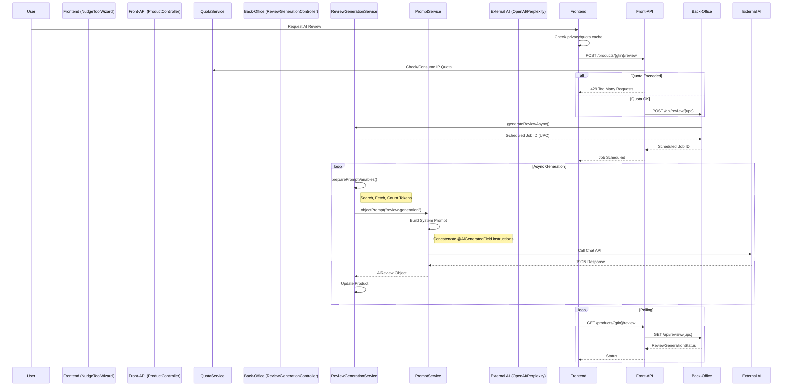

# GenAI Service Audit

## Architecture Overview

The GenAI service in Open4Goods is a distributed system involving the Frontend, Front-API, and the Back-Office API (Core).

### Flow Diagram



## Quota Management

IP-based quotas are enforced at the **Front-API** level to protect the back-office from abuse.

- **Service**: `QuotaService`
- **Configuration**: `ReviewGenerationProperties` (default: 3 requests per IP per 24h).
- **Enforcement**: `ProductMappingService` checks `QuotaService` before calling the `ReviewGenerationClient`.
- **Frontend**: `AccountPrivacyCard.vue` uses `useIpQuota.ts` to display remaining quota to the user.

## Prompt Engineering

The system uses a "POJO-oriented" prompt engineering approach, combining external templates with code-defined instructions.

1.  **Template (`review-generation.yml`)**: Defines the base System and User prompts. It uses Thymeleaf for variable substitution (e.g., `${PRODUCT_NAME}`, `${sources}`).
2.  **Code Instructions (`@AiGeneratedField`)**: specific instructions for each field of the `AiReview` object are defined directly in the Java class using annotations.
    ```java
    @AiGeneratedField(instruction = "Description du produit, 150 mots maximum")
    private String description;
    ```
3.  **Concatenation (`PromptService`)**:
    - Calls `AiFieldScanner.getGenAiInstruction(type)` to extract all annotated instructions.
    - Appends these instructions to the System Prompt:
      > "En complément du schéma JSON, voici les instructions concernant chaque champs que tu dois fournir..."

### Benefits & Risks

- **Benefits**: Keeps instructions close to the data model (Documentation as Code). Ensures the AI knows exactly what to generate for each JSON field.
- **Risks**:
  - **Localization**: Hardcoded French text in `PromptService` limits specific support to other languages.
  - **Determinism**: Field order depends on reflection (`getDeclaredFields`), which isn't guaranteed deterministic without explicit sorting.

## ReviewGenerationService Analysis

The `ReviewGenerationService` orchestrates the complex flow of gathering context before calling the AI.

### Workflow

1.  **Check**: `shouldGenerateReview` (cache validity).
2.  **Preprocessing**:
    - **Search**: Google Search for Brand + Model.
    - **Fetch**: Concurrent scraping of top results.
    - **Filter**: Discard PDF, low token count, or preferred domain logic.
    - **Count**: Accumulate tokens up to `maxTotalTokens`.
3.  **Prompt Prep**:
    - Injects `sources`, `tokens`, `PRODUCT_DETAILS`.
    - Manually constructs the `ATTRIBUTES` list string.
4.  **Generation**: Calls `PromptService` with "review-generation" key.
5.  **Post-processing**:
    - `updateAiReviewReferences`: Replaces `[1]` with HTML links.
    - `populateAttributes`: Extracts dynamic attributes.

