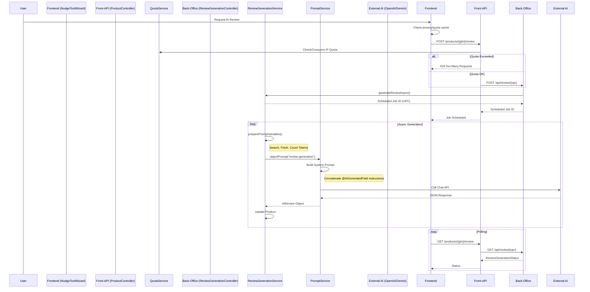

# GenAI Service Audit

## Architecture Overview

The GenAI service in Open4Goods is a distributed system involving the Frontend, Front-API, and the Back-Office API (Core).

### Flow Diagram


```mermaid
sequenceDiagram
    participant User
    participant Frontend (NudgeToolWizard)
    participant Front-API (ProductController)
    participant QuotaService
    participant Back-Office (ReviewGenerationController)
    participant ReviewGenerationService
    participant PromptService
    participant External AI (OpenAI/Gemini)

    User->>Frontend: Request AI Review
    Frontend->>Frontend: Check privacy/quota cache
    Frontend->>Front-API: POST /products/{gtin}/review
    Front-API->>QuotaService: Check/Consume IP Quota
    alt Quota Exceeded
        Front-API-->>Frontend: 429 Too Many Requests
    else Quota OK
        Front-API->>Back-Office: POST /api/review/{upc}
    end
    Back-Office->>ReviewGenerationService: generateReviewAsync()
    ReviewGenerationService-->>Back-Office: Scheduled Job ID (UPC)
    Back-Office-->>Front-API: Scheduled Job ID
    Front-API-->>Frontend: Job Scheduled

    loop Async Generation
        ReviewGenerationService->>ReviewGenerationService: preparePromptVariables()
        note right of ReviewGenerationService: Search, Fetch, Count Tokens
        ReviewGenerationService->>PromptService: objectPrompt("review-generation")
        PromptService->>PromptService: Build System Prompt
        note right of PromptService: Concatenate @AiGeneratedField instructions
        PromptService->>External AI: Call Chat API
        External AI-->>PromptService: JSON Response
        PromptService-->>ReviewGenerationService: AiReview Object
        ReviewGenerationService->>ReviewGenerationService: Update Product
    end

    loop Polling
        Frontend->>Front-API: GET /products/{gtin}/review
        Front-API->>Back-Office: GET /api/review/{upc}
        Back-Office-->>Front-API: ReviewGenerationStatus
        Front-API-->>Frontend: Status
    end
```

## Quota Management

IP-based quotas are enforced at the **Front-API** level to protect the back-office from abuse.

- **Service**: `QuotaService`
- **Configuration**: `ReviewGenerationProperties` (default: 3 requests per IP per 24h).
- **Enforcement**: `ProductMappingService` checks `QuotaService` before calling the `ReviewGenerationClient`.
- **Frontend**: `AccountPrivacyCard.vue` uses `useIpQuota.ts` to display remaining quota to the user.

## Prompt Engineering

The system uses a "POJO-oriented" prompt engineering approach, combining external templates with code-defined instructions.

1.  **Template (`review-generation.yml`)**: Defines the base System and User prompts. It uses Thymeleaf for variable substitution (e.g., `${PRODUCT_NAME}`, `${sources}`).
2.  **Code Instructions (`@AiGeneratedField`)**: specific instructions for each field of the `AiReview` object are defined directly in the Java class using annotations.
    ```java
    @AiGeneratedField(instruction = "Description du produit, 150 mots maximum")
    private String description;
    ```
3.  **Concatenation (`PromptService`)**:
    - Calls `AiFieldScanner.getGenAiInstruction(type)` to extract all annotated instructions.
    - Appends these instructions to the System Prompt:
      > "En complément du schéma JSON, voici les instructions concernant chaque champs que tu dois fournir..."

### Benefits & Risks

- **Benefits**: Keeps instructions close to the data model (Documentation as Code). Ensures the AI knows exactly what to generate for each JSON field.
- **Risks**:
  - **Localization**: Hardcoded French text in `PromptService` limits specific support to other languages.
  - **Determinism**: Field order depends on reflection (`getDeclaredFields`), which isn't guaranteed deterministic without explicit sorting.

## ReviewGenerationService Analysis

The `ReviewGenerationService` orchestrates the complex flow of gathering context before calling the AI.

### Workflow

1.  **Check**: `shouldGenerateReview` (cache validity).
2.  **Preprocessing**:
    - **Search**: Google Search for Brand + Model.
    - **Fetch**: Concurrent scraping of top results.
    - **Filter**: Discard PDF, low token count, or preferred domain logic.
    - **Count**: Accumulate tokens up to `maxTotalTokens`.
3.  **Prompt Prep**:
    - Injects `sources`, `tokens`, `PRODUCT_DETAILS`.
    - Manually constructs the `ATTRIBUTES` list string.
4.  **Generation**: Calls `PromptService` with "review-generation" key.
5.  **Post-processing**:
    - `updateAiReviewReferences`: Replaces `[1]` with HTML links.
    - `populateAttributes`: Extracts dynamic attributes.

## AI Usage Inventory Beyond Review Generation

### LLM-related components

- `services/prompt` is the main Spring AI integration module and already exposes provider abstraction and registry patterns.
- `api` uses this layer for both review enrichment and impact-score matrix generation flows.

### Embedding-related components

- `services/embedding-djl` provides local DJL inference for:
  - text embeddings (`DjlTextEmbeddingService`)
  - image embeddings (`DjlImageEmbeddingService`)
- `api` uses text embeddings in product aggregation and image embeddings in resource completion/clusterization.
- `api` exposes a text embedding endpoint (`GET /api/product/embedding`) consumed by `front-api` proxy mode.
- `front-api` can either compute local embeddings directly or proxy to the API endpoint depending on configuration.

## Centralization Plan (OpenAI/LocalAI-compatible)

### 1) Target: unified capability-based AI contract

Create one logical gateway with capability interfaces:

- chat generation
- text embeddings
- image embeddings
- batch generation

Each capability resolves provider by configuration (`openai`, `localai`, `gemini`, `djl-local`) and shares common resilience/observability behavior.

### 2) Endpoint contract standardization

Use OpenAI-compatible wire contracts by default:

- Chat: `/v1/chat/completions`
- Embeddings: `/v1/embeddings`
- Batch/File (when available): `/v1/batches`, `/v1/files`

Keep provider-specific translation only in adapter classes, not in business services.

### 3) Config unification

Introduce a single configuration namespace (example):

- `open4goods.ai.capabilities.chat.provider`
- `open4goods.ai.capabilities.text-embedding.provider`
- `open4goods.ai.capabilities.image-embedding.provider`
- `open4goods.ai.providers.openai.base-url`, `api-key`, `model`
- `open4goods.ai.providers.localai.base-url`, `model`
- `open4goods.ai.providers.djl.*`

Add backward-compatible mapping from existing prompt/embedding properties during transition.

### 4) Migration strategy

1. Wrap existing `PromptService` and DJL services behind capability adapters (no behavior change).
2. Migrate `api` callers (`GenAiController`, `VerticalsGenerationService`, aggregation and completion services) to gateway interfaces.
3. Align `front-api` on one explicit embedding strategy (proxy-first or direct-first) with documented fallback.
4. Add contract tests against OpenAI-compatible mock endpoints + health indicators per capability/provider.

### 5) Non-functional requirements

- Per-capability metrics (latency, errors, retries, tokens/cost where available).
- Structured logs with correlation IDs and sensitive-data redaction.
- Timeouts, retries, circuit-breakers, and idempotency for async/batch flows.
- Feature flags for gradual rollout by capability.

## Clarifications Needed Before Implementation

1. Preferred deployment shape: in-process shared library first, or dedicated AI gateway microservice now?
2. Embedding priority for next iterations:
   - keep DJL local as default,
   - move text embeddings first to OpenAI-compatible endpoints,
   - or hybrid by environment/use case?
3. Compatibility requirement level: strict OpenAI payload/response compatibility vs adapter-tolerant compatibility?
4. Do you want centralized model routing per use case (impact matrix vs product enrichment) in configuration?
5. Are there environments where external AI calls are forbidden (data residency/compliance), requiring forced-local mode?
